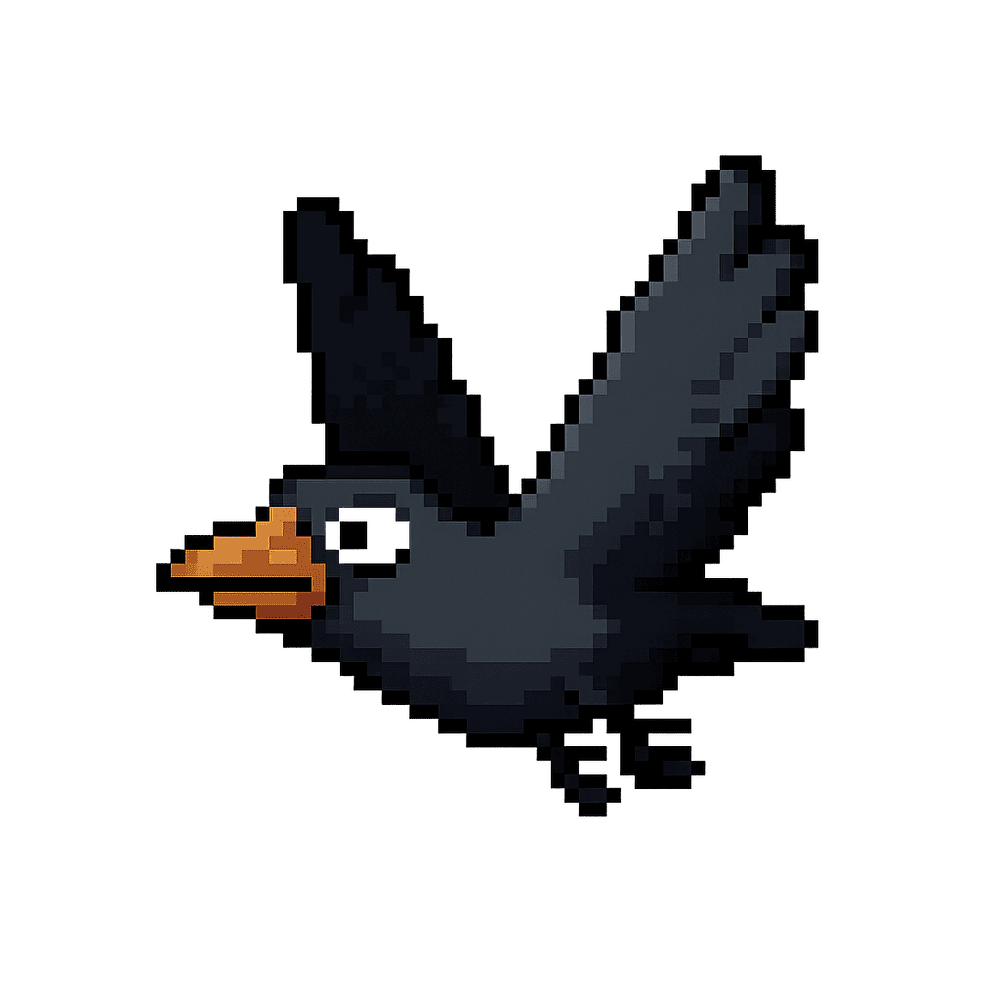
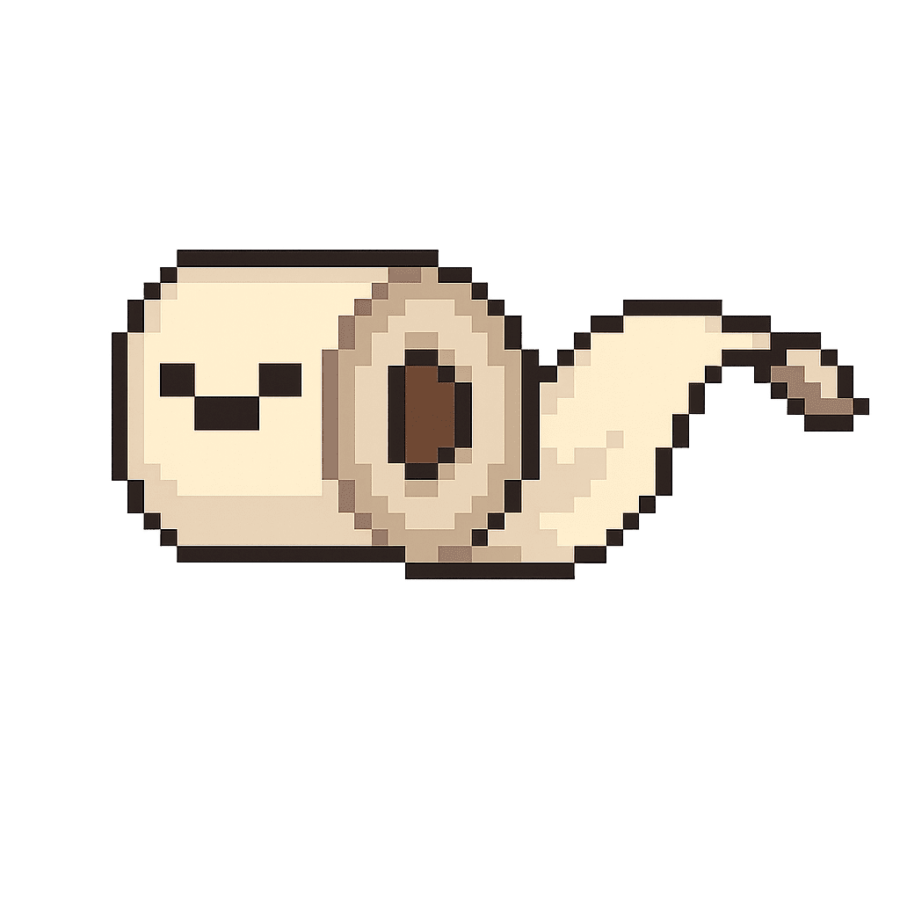
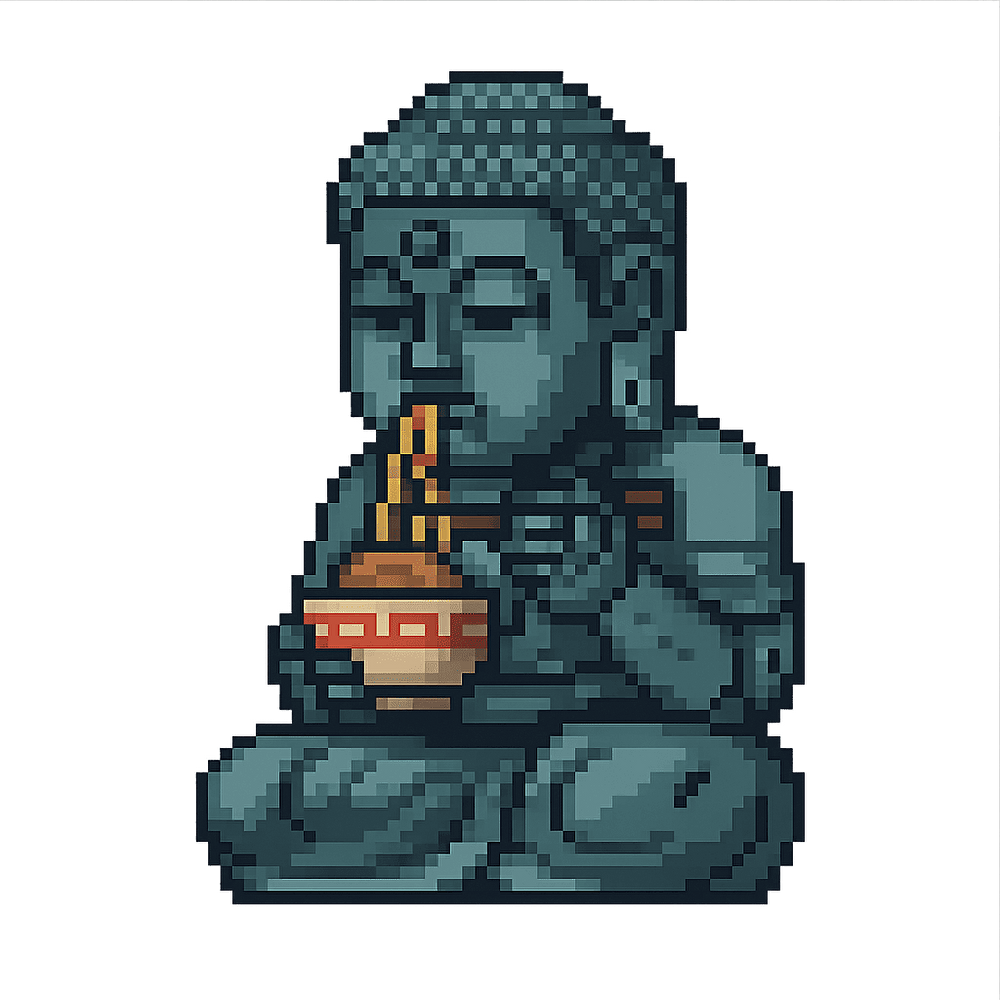
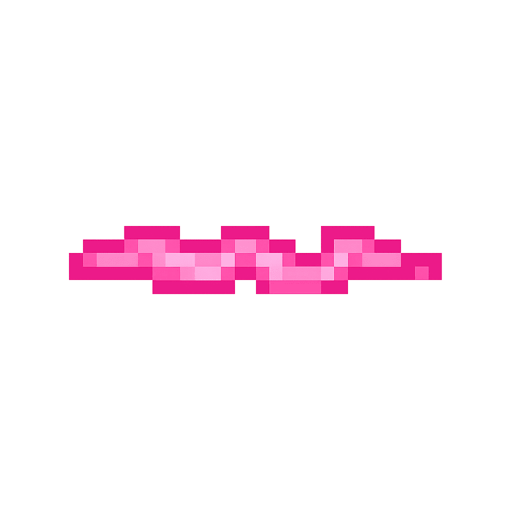

## 横スクロール突撃ゲーム

## ゲームの説明

このゲームは、プレイヤー機を操作して敵編隊を突破する横スクロール型のアクションゲームです。攻撃手段は体当たりのみで、支援機（子機）と連携しながら敵機・敵弾を捌き、高スコアを目指します。

## ゲームの特徴

### 操作方法

- キーボード: 矢印キーまたは WASD で移動、スペースキーでゲーム開始/再スタート。
- ポインタ: クリック・ドラッグ、タッチ操作で機体を追従させ、待機中/ゲームオーバー中はタップでもスタート可能。
- ポインタ操作時はスムージング追従が働き、過度なブレを抑えながら移動します。

### 攻撃とパワーアップ

- プレイヤー機は体当たりで敵にダメージを与えます。命中後は 0.28 秒のクールダウンが発生。
- パワーアップアイテムを取得すると `powerLevel` が最大16まで上昇し、攻撃力が強化されます（レベル1は親機のみで、以降は支援機が1機ずつ追加）。
- `powerLevel` が上限に達していても、支援機が最大15機に届くまではパワーアップ取得ごとに子機が1機ずつ追加されます。攻撃力・子機ともに上限後は取得時にスコア +200 点。

### 支援機 (子機)

- 支援機は最大15機まで展開でき、先頭列は左右3列のグリッド、後続は縦に連なる陣形で配置されます。既存の陣形は維持され、新たに追加された子機のみ編隊に加わります。撃破時も残った子機はその場で隊形を保ち、再接続だけを行います。
- それぞれ最大5ヒットの耐久力を持ち、敵弾や敵機との接触で身代わりになります。耐久が尽きた支援機は破壊され、再補充には新たなパワーアップが必要です。
- 被弾中はスプライトが瞬間的に色反転し、視覚的なダメージフィードバックを与えます。
- 敵機との接触時には敵へ1ダメージを与え、ボスにも有効です。
- バネ挙動によるスムーズな追従と、撃破時の爆発・敵押し戻し処理を備えています。

### 敵キャラクター

- 基本敵（grunt）、中ボス（midBoss）、ボス（boss）の3種類が存在し、それぞれ移動パターンと攻撃手段が異なります。
- 中ボスは約10〜16秒間隔、ボスは20秒経過後に登場し、出現から60秒以内に撃破できないと時間切れでゲームオーバーになります（HUD にカウントダウンを表示）。ボスは画面に収まった地点で前進を止め、上下移動だけを続け、撃破するとゲームクリアです。
- 被弾した敵機は瞬間的に色反転演出がかかり、ダメージフィードバックを与えます。

### 背景

- 海中をイメージした背景が右から左へ流れ、ゲーム進行を演出します。

## 画像

Bing Image Creator（DALL-E 3 ベース）で生成した画像を使用しています。

- プレイヤーの宇宙船

- 敵キャラクター

- 背景

- パワーアップアイテム

- レーザーショット

- 爆発エフェクト

- ゲームオーバー画面

## 動作環境

- Webブラウザ（Google Chrome, Mozilla Firefox, Microsoft Edgeなど）
- インターネット接続は不要（ローカルで動作可能） 

## 開発環境

- 開発言語: JavaScript
- フレームワーク: HTML5 Canvas API
- 開発ツール: Visual Studio Code, GitHub    
